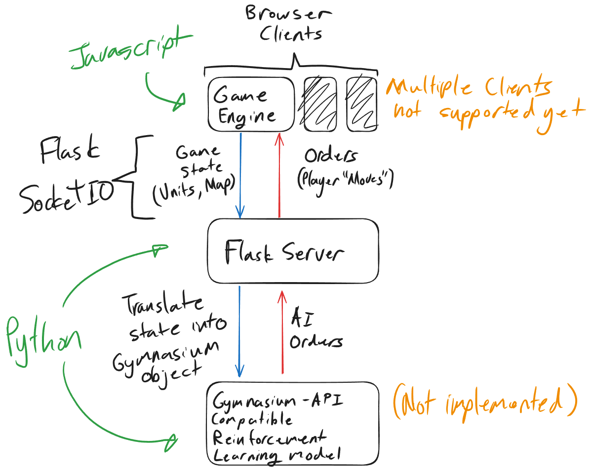

# Lines of battle AI

Train lines of battle (<https://linesofbattle.net/>) "commanders" using reinforcement learning.

Game runs on the web browser, which communicates the game state to a flask python server using websockets (flask-socketio).
The python server translates the game state into a gymnasium object, which is then used to train an AI model.
The moves generated via the model are then sent back to the browser using websockets.

Running:

- Install dependencies "pip install -r requirements.txt"
- Run "python server.py" and then open a web browser on <http://localhost:8000/>
- The server should automatically connect to the client
- Create a new game in the web browser and play at least one turn (to populate units), and then run test3() in the browser console to initiate the game loop

Structure:

- downloaded game engine files are located in serverFiles. State sending and handling on the client-side is located in /serverFiles/_myFiles
- flask python server is located in server.py

TODO:

- Set up gymnasium translation layer
- Seperate server.py into multiple classes
- Implement reinforcement learning
- Stop browser rendering
- Support for multiple clients
